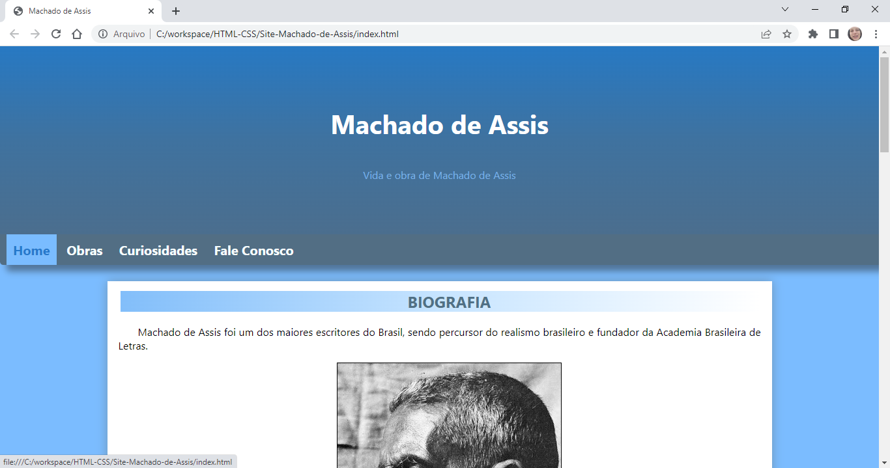

<h1 align="center">
    PROJETOS HTML/CSS
</h1>

<h2>
    Aprendendo Bootstrap
</h2>

## Layout

## :rocket: Sobre esse projeto

    No bootcamp da DIO, enquanto aprendia a utilização do bootstrap, criei esse site. Embora simples, pude fortalecer conhecimentos de CSS e ver como o framework é aplicado em um site

## :computer: Conceitos Aprendidos

- Conectar o bootstrap no site ou importar arquivos
- Utilizar elementos do bootstrap para criar botões e modificar divs
- Fortalecer conhecimentos de HTML e CSS

<h2>
    Machado de Assis
</h2>

## Layout

## :rocket: Sobre esse projeto

    Esse site foi criado pelo curso de front-end realizado pela <strong> SER MAIS </strong> em parceria com a <strong> Avanade </strong> para fixar os conceitos aprendidos sobre HTML e CSS.

## :computer: Conceitos Aprendidos

- Tags semânticas: header, nav, footer, etc.
- Estilizando elementos com CSS.
- Trabalhando com gradientes

<h2>
    Cientistas Mulheres
</h2>

## Layout

## :rocket: Sobre esse projeto

    Nesse projeto, o intuito era fixar os conhecimentos sobre HTML e CSS. Foi uma iniciativa do <strong> PROGRAMARIA </strong> no EuProgramo, com foco em trazer mulheres para a area da programação.

## :computer: Conceitos Aprendidos

- Estruturar páginas
- Fortalecer conhecimentos de HTML e CSS